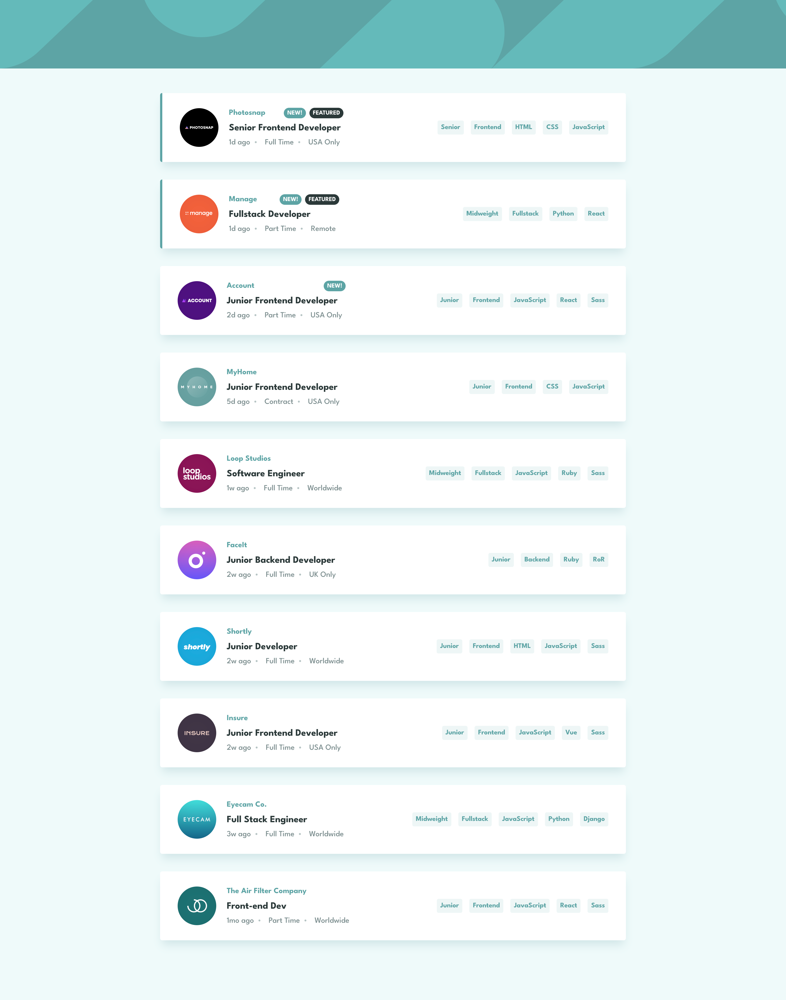

# Frontend Mentor - Job listings with filtering solution

This is a solution to the [Job listings with filtering challenge on Frontend Mentor](https://www.frontendmentor.io/challenges/job-listings-with-filtering-ivstIPCt). Frontend Mentor challenges help you improve your coding skills by building realistic projects. 

## Table of contents

- [Frontend Mentor - Job listings with filtering solution](#frontend-mentor---job-listings-with-filtering-solution)
  - [Table of contents](#table-of-contents)
  - [Overview](#overview)
    - [The challenge](#the-challenge)
    - [Screenshot](#screenshot)
    - [Links](#links)
  - [Built with](#built-with)
  - [Author](#author)

## Overview

### The challenge

Users should be able to:

- [x] View the optimal layout for the site depending on their device's screen size
- [x] See hover states for all interactive elements on the page
- [x] Filter job listings based on the categories

### Screenshot

### Links

- Live Site URL: [https://6rian-frontendmentor-job-listing.netlify.app/](https://6rian-frontendmentor-job-listing.netlify.app/)

## Built with

- Semantic HTML5 markup
- Flexbox
- Mobile-first workflow
- Vite
- [React](https://reactjs.org/)
- [SCSS](https://sass-lang.com/)
- CSS Modules

## Author

- Website - [6rian.com](https://www.6rian.com)
- Frontend Mentor - [@6rian](https://www.frontendmentor.io/profile/6rian)
